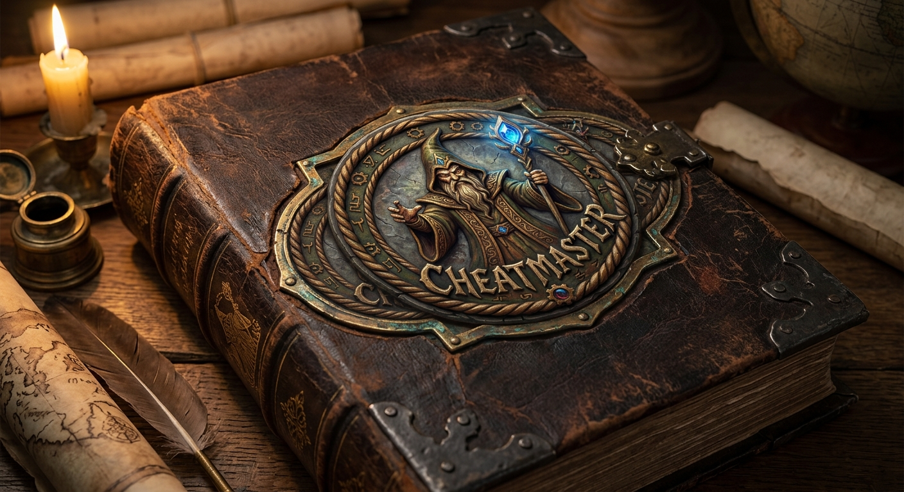

<p align="center">
  
</p>

# Cheatmaster

A memory scanner and cheat table editor for Windows, built around one idea:

**You should not have to know how a game stores a number in order to find it.**

Every other scanner asks you to pick a type before you search. Pick wrong and you get
nothing — no results, no explanation, no hint that the only thing wrong was the dropdown.
Cheatmaster tests every plausible encoding at once and tells you which ones survived.

---

## The problem

You can see `100` on screen. In memory it could be any of these:

| What the game stores | Why |
| --- | --- |
| `100` as a 4-byte integer | the obvious case |
| `100.0` as a float | most modern engines |
| `82.67` as a float | the interface rounds for display |
| `0.75` as a float | stored as a fraction of full, shown as a percentage |
| `10000` as an integer | scaled by 100 to avoid fractions |
| `6553600` as an integer | 16.16 fixed point |
| `0x00000064` byte-reversed | ports, emulators, network state |
| `value ^ key` | obfuscated by an anti-tamper library |

Search for `100` as "4 Bytes" and seven of those eight find nothing at all.

## What Cheatmaster does instead

Type the number you can see and press scan. The engine builds every plausible
*interpretation* — machine type × byte order × scale factor × bias × XOR key — turns each
one into a range of raw byte patterns, and tests them all in a single pass over memory.

Then it reports what it learned:

```
Best match: Float (12).
3 other encodings still possible — change the value in the game and scan
again, and the wrong ones will drop out.

  [ Float 12 ]  [ Int32 3,391 ]  [ Int32 ×100 45 ]  [ Float ÷100 (percent) 8 ]
```

Each surviving theory is a chip you can pin (only consider this from now on) or collapse
to (throw away everything else immediately). A wrong theory usually matches thousands of
addresses while the right one matches a handful, so the answer is normally obvious on the
first scan and certain by the second.

### Display accuracy

A health bar reading `83` is very often `82.67` in memory. Cheatmaster's default
**Display** mode accepts any stored value that would *print* as what you typed, covering
both rounding and truncation. Set it to **Exact** when you want a literal match, or
**Loose** for meters that only approximate.

## Features

**Scanning**
- Automatic storage detection across 10 machine types, scaled and percentage storage,
  fixed point, byte-swapped storage, and constant XOR keys
- Vectorised parallel scan across all cores, multiple gigabytes in seconds
- Equal / not equal / greater / less / between, and change-based narrowing
  (changed, unchanged, increased, decreased, increased-by, decreased-by)
- Per-theory result caps, so an encoding that matches half of memory is flagged as noise
  instead of drowning the useful answers
- Undo, so a scan that narrowed too far costs one click rather than starting over
- Region control: writable-only, module / heap / mapped memory, address step

**Editing**
- Cheat table with live values, in-place editing, and freezing
- Freezing rewrites on a timer, so the game cannot take a value back
- Global hotkeys to toggle a cheat without leaving the game

**Per-game library**
- Cheats are saved per game automatically and come back the next time you attach
- Games are matched by executable name and content hash, so a new build gets its own
  table and you are told when cheats exist for a different version
- Addresses are anchored to a module and offset where possible, so a saved table still
  works after a restart. Entries that can only be a raw address are marked as such.
- Tables are individual files, so one game's cheats can be shared as one file

## Requirements

- Windows 10 or 11, 64-bit
- [.NET 10 Desktop Runtime](https://dotnet.microsoft.com/download/dotnet/10.0)

A 64-bit build attaches to both 64-bit and 32-bit targets. Most targets open without
elevation; when one refuses, the app offers a one-click elevated restart rather than
demanding a UAC prompt every launch.

## Building

```sh
dotnet build -c Release
dotnet test  -c Release
```

The app is `src/Cheatmaster.App`, the engine is `src/Cheatmaster.Core`, and the engine has
no UI dependency. `dotnet run --project tools/IconForge` regenerates the application icon
from the source art.

Start with `--diag` to surface data-binding problems in the app instead of only in the log
at `%LOCALAPPDATA%\Cheatmaster\binding-errors.log`.

## Scope

Cheatmaster is for single-player and offline play, and for taking apart software you own.

It does not attempt to defeat, hide from, or evade anti-cheat systems, and it will not
grow features that do. Editing another player's experience in a multiplayer game is not
what this is for.

## License

GPL-3.0. See [LICENSE](LICENSE).
